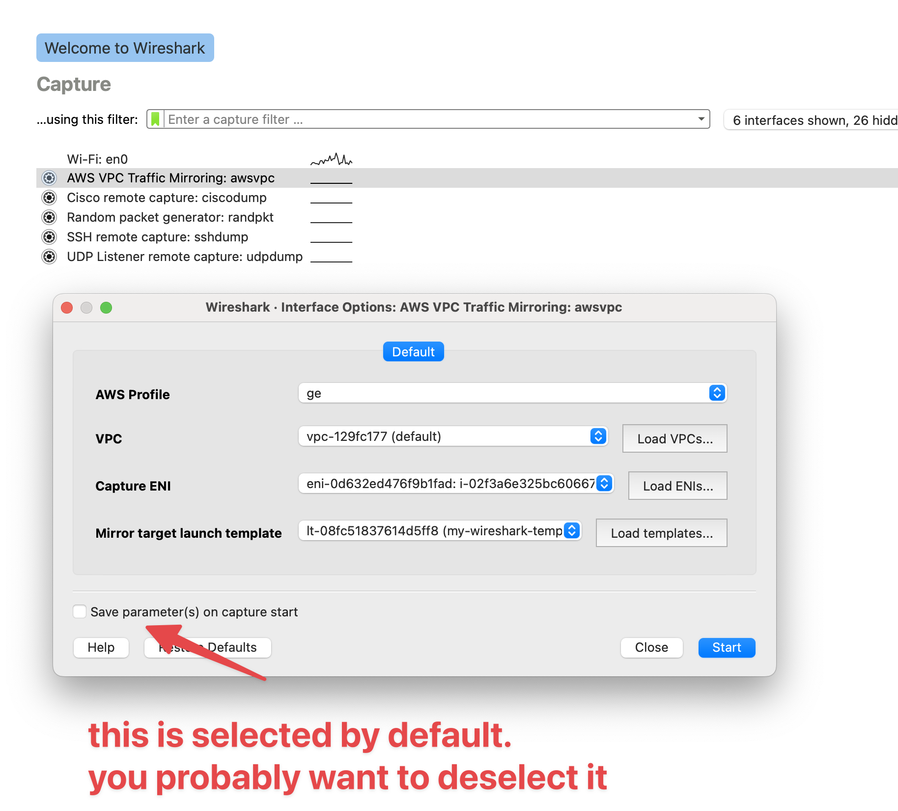

# vpcshark

`vpcshark` is an `extcap` Wireshark plugin that automates VPC traffic mirroring.
Specifically it creates (on-demand, for each Wireshark session):

* An EC2 instance to receive mirrored traffic
* A traffic mirror _target_ pointed at the above EC2 instance
* A traffic mirror _filter_ that permits all traffic (TODO: scope down to match 
  Wireshark capture filter)
* A traffic mirror _session_ for the EC2 ENI that you are mirroring

It _should_ terminate the EC2 instance after the Wireshark capture session
has been stopped. But it is buggy and not properly implemented yet. Likewise,
automatic destruction of traffic mirror sessions is not implemented. Run
`vpcshark --cleanup --profile <aws profile name>` to clean up traffic mirror
resources.

## Usage

First you need to build the remote tool that is copied to and executed on the
remote EC2 instance. You can do that like this:

    (cd remote; GOOS=linux GOARCH=arm64 CGO_ENABLED=0 go build -ldflags="-s -w"; upx remote)

The `upx` step is optional, but makes copying the file faster. After that, you 
can `go build` the vpcshark executable like normal. These steps are needed
because the `remote` binary is actually copied into the `vpcshark` binary.

Logs will appear in `/tmp/vpcshark.log`.

You need to copy (or symlink) `vpcshark` into the `extcap` directory. By default
that is `/Applications/Wireshark.app/Contents/MacOS/extcap/` on macOS. When you
launch Wireshark, you will see a new capture interface named _AWS VPC Traffic Mirroring: awsvpc_.
Double-clicking this will yield the following dialogue box:

First, select an AWS profile. If you use AWS SSO, then you should have already
previously logged into this profile recently. 

Next, click _Load VPCs…_. This will refresh the VPC dropdown box. Select the VPC
that contains the ENI you are interested in mirroring.

Next, click _Load ENIs…_. This will refresh the ENI dropbox box. Select the ENI
you are interested in mirroring.

Finally, click _Load templates…_ and select the EC2 launch template you want to
use for the temporary EC2 instance that will be launched as the traffic mirror
target.

**Note**: the launch template should include everything that is required to launch
an EC2 instance at a minimum. This means you need to specify:

* An AMI. This should be one based on Amazon Linux 2. Specifically one that can
  `sudo yum install socat`.
* An instance type
* A subnet (in the same VPC that you are mirroring traffic)
* A security group that has at least UDP port 4789 open to the VPC CIDR and
  SSH open to your personal IP address.
* An ENI with an auto-assigned public IP address (if that is not already the
  default for your chosen subnet)
